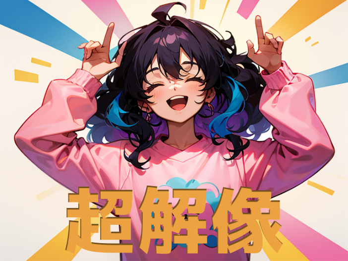
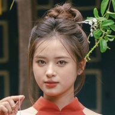
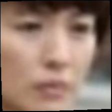
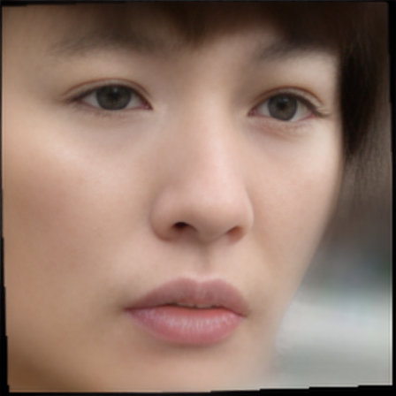
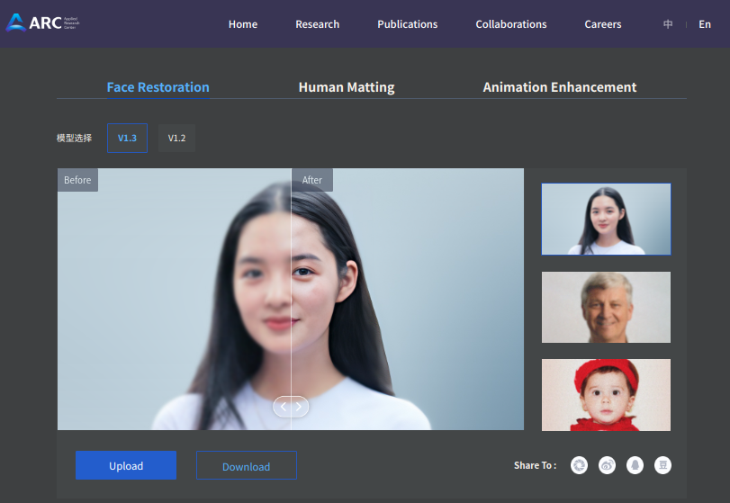

# 画像拡大マスター：超解像セットアップシリーズ②
超解像シリーズは全部で4編書きます。
1.　MAX Image Resolution Enhancer
2.　GFPGAN
3.　VQFR
4.　1~3の比較

この超解像シリーズでは、いくつかの超解像技術をピックアップして、それぞれの環境構築方法を中心にご紹介します。

今回は、`GFPGAN`です。



## 出力結果
顔に特化した学習モデルを用いるため、一般物（ここでは猫）に対しては、あまり効果がありません。
### 元画像



### 超解像画像




- [画像拡大マスター：超解像セットアップシリーズ②](#画像拡大マスター超解像セットアップシリーズ)
  - [出力結果](#出力結果)
    - [元画像](#元画像)
    - [超解像画像](#超解像画像)
  - [GFPGANとは](#gfpganとは)
    - [論文](#論文)
  - [ホスト環境](#ホスト環境)
  - [ローカル環境構築](#ローカル環境構築)
  - [推論の実行](#推論の実行)
    - [引数一覧](#引数一覧)
  - [まとめ](#まとめ)

## GFPGANとは
GFPGANは、顔復元のためのツールで、TencentARCによって提供されています。

リポジトリには、事前学習済みのEuropean Castleモデルが含まれています。

https://github.com/TencentARC/GFPGAN#european_castle-model-zoo

GFPGANがどのように顔画像を復元できるのかを確認できるデモページ

https://arc.tencent.com/en/ai-demos/faceRestoration



### 論文
Towards Real-World Blind Face Restoration with Generative Facial Prior

https://arxiv.org/pdf/2101.04061.pdf

## ホスト環境
```bash
$ nvcc --version
nvcc: NVIDIA (R) Cuda compiler driver
Copyright (c) 2005-2023 NVIDIA Corporation
Built on Fri_Jan__6_16:45:21_PST_2023
Cuda compilation tools, release 12.0, V12.0.140
Build cuda_12.0.r12.0/compiler.32267302_0

$ nvidia-smi
Fri Oct 20 18:38:04 2023       
+-----------------------------------------------------------------------------+
| NVIDIA-SMI 525.85.12    Driver Version: 525.85.12    CUDA Version: 12.0     |
|-------------------------------+----------------------+----------------------+
| GPU  Name        Persistence-M| Bus-Id        Disp.A | Volatile Uncorr. ECC |
| Fan  Temp  Perf  Pwr:Usage/Cap|         Memory-Usage | GPU-Util  Compute M. |
|                               |                      |               MIG M. |
|===============================+======================+======================|
|   0  NVIDIA GeForce ...  On   | 00000000:08:00.0  On |                  N/A |
| 41%   38C    P8    13W / 120W |    842MiB /  6144MiB |      5%      Default |
|                               |                      |                  N/A |
+-------------------------------+----------------------+----------------------+

$ inxi -SGm
System:    Host: user Kernel: 5.15.0-86-generic x86_64 bits: 64 Desktop: Gnome 3.36.9 
           Distro: Ubuntu 20.04.6 LTS (Focal Fossa) 
Memory:    RAM: total: 15.55 GiB used: 8.42 GiB (54.2%) 
           RAM Report: permissions: Unable to run dmidecode. Root privileges required. 
Graphics:  Device-1: NVIDIA TU116 [GeForce GTX 1660 Ti] driver: nvidia v: 525.85.12 
           Display: x11 server: X.Org 1.20.13 driver: fbdev,nouveau unloaded: modesetting,vesa resolution: 2560x1440~60Hz 
           OpenGL: renderer: NVIDIA GeForce GTX 1660 Ti/PCIe/SSE2 v: 4.6.0 NVIDIA 525.85.12 
```

## ローカル環境構築

1. **リポジトリのクローン**:
   プロジェクトを始めるには、まずGFPGANのリポジトリをクローンします。
```bash
$ git clone https://github.com/TencentARC/GFPGAN.git
```

2. **ディレクトリの変更**:
   クローンしたリポジトリのディレクトリに移動します。
```bash
$ cd GFPGAN
```

3. **仮想環境の作成とアクティベート**:
   Pythonの仮想環境を作成し、アクティベートします。これにより、プロジェクトの依存関係がシステムの他の部分と干渉することなく管理できます。
```bash
$ python3 -m venv .
$ . bin/activate
```

4. **パッケージマネージャのアップデート**:
   最新の`pip`, `setuptools`, `wheel`をインストールします。
```bash
(GFPGAN) $ pip install -U pip setuptools wheel
```

5. **依存関係のインストール**:
   必要な依存関係をインストールします。
```bash
(GFPGAN) $ pip install basicsr
(GFPGAN) $ pip install facexlib
(GFPGAN) $ pip install -r requirements.txt
```

6. **セットアップ**:
   `setup.py` スクリプトを使ってプロジェクトをセットアップします。
```bash
(GFPGAN) $ python setup.py develop
```

7. **追加の依存関係のインストール**:
   `realesrgan` と `nvidia-nvjitlink-cu12` をインストールし、その後、`torch`をアンインストールして再インストールします。
```bash
(GFPGAN) $ pip install realesrgan
(GFPGAN) $ pip install nvidia-nvjitlink-cu12==12.1.55
(GFPGAN) $ pip uninstall torch
(GFPGAN) $ pip install -U torch
```

8. **モデルのダウンロード**:
   ダウンロードしたモデル（GFPGANv1.4.pth）を、以下のディレクトリに配置します。
```bash
GFPGAN/experiments/pretrained_models
```

## 推論の実行
   `inference_gfpgan.py` スクリプトを使って画像の超解像を実行します。この例では、`1.png`という画像に対して操作を行っています。
```bash
(GFPGAN) $ python inference_gfpgan.py -i /home/user/ダウンロード/1.png  -v 1.4 -s 2
```

初回の実行時にのみ、必要なモデルがダウンロードされます。
ダウンロードされたモデルは、以下のディレクトリに保存されます。
```bash
GFPGAN/gfpgan/weights
```

```bash
$ python inference_gfpgan.py -i /home/user/ダウンロード/1.png  -v 1.4 -s 2
/home/user/bin/GFPGA/GFPGAN/lib/python3.8/site-packages/torchvision/transforms/functional_tensor.py:5: UserWarning: The torchvision.transforms.functional_tensor module is deprecated in 0.15 and will be **removed in 0.17**. Please don't rely on it. You probably just need to use APIs in torchvision.transforms.functional or in torchvision.transforms.v2.functional.
  warnings.warn(
/home/user/bin/GFPGA/GFPGAN/lib/python3.8/site-packages/torch/cuda/__init__.py:138: UserWarning: CUDA initialization: CUDA unknown error - this may be due to an incorrectly set up environment, e.g. changing env variable CUDA_VISIBLE_DEVICES after program start. Setting the available devices to be zero. (Triggered internally at ../c10/cuda/CUDAFunctions.cpp:108.)
  return torch._C._cuda_getDeviceCount() > 0
inference_gfpgan.py:63: UserWarning: The unoptimized RealESRGAN is slow on CPU. We do not use it. If you really want to use it, please modify the corresponding codes.
  warnings.warn('The unoptimized RealESRGAN is slow on CPU. We do not use it. '
/home/user/bin/GFPGA/GFPGAN/lib/python3.8/site-packages/torchvision/models/_utils.py:208: UserWarning: The parameter 'pretrained' is deprecated since 0.13 and may be removed in the future, please use 'weights' instead.
  warnings.warn(
/home/user/bin/GFPGA/GFPGAN/lib/python3.8/site-packages/torchvision/models/_utils.py:223: UserWarning: Arguments other than a weight enum or `None` for 'weights' are deprecated since 0.13 and may be removed in the future. The current behavior is equivalent to passing `weights=None`.
  warnings.warn(msg)
Downloading: "https://github.com/xinntao/facexlib/releases/download/v0.1.0/detection_Resnet50_Final.pth" to /home/user/bin/GFPGA/GFPGAN/gfpgan/weights/detection_Resnet50_Final.pth

100%|████████████████████████████████████████████████████████████████████████████████████████████████████| 104M/104M [01:18<00:00, 1.40MB/s]
Downloading: "https://github.com/xinntao/facexlib/releases/download/v0.2.2/parsing_parsenet.pth" to /home/user/bin/GFPGA/GFPGAN/gfpgan/weights/parsing_parsenet.pth

100%|██████████████████████████████████████████████████████████████████████████████████████████████████| 81.4M/81.4M [00:58<00:00, 1.46MB/s]
Processing 1.png ...
Results are in the [results] folder.
```

### 引数一覧
```bash
Usage: python inference_gfpgan.py -i inputs/whole_imgs -o results -v 1.3 -s 2 [options]...

  -h                   show this help
  -i input             Input image or folder. Default: inputs/whole_imgs
  -o output            Output folder. Default: results
  -v version           GFPGAN model version. Option: 1 | 1.2 | 1.3. Default: 1.3
  -s upscale           The final upsampling scale of the image. Default: 2
  -bg_upsampler        background upsampler. Default: realesrgan
  -bg_tile             Tile size for background sampler, 0 for no tile during testing. Default: 400
  -suffix              Suffix of the restored faces
  -only_center_face    Only restore the center face
  -aligned             Input are aligned faces
  -ext                 Image extension. Options: auto | jpg | png, auto means using the same extension as inputs. Default: auto
```

## まとめ
GFPGANを用いた、Face Restorationのローカル環境構築と、その結果を確認しました。
以上です。ありがとうございました。